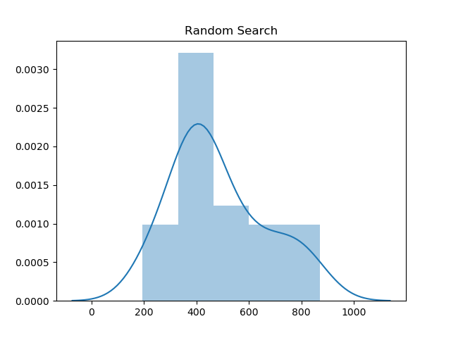
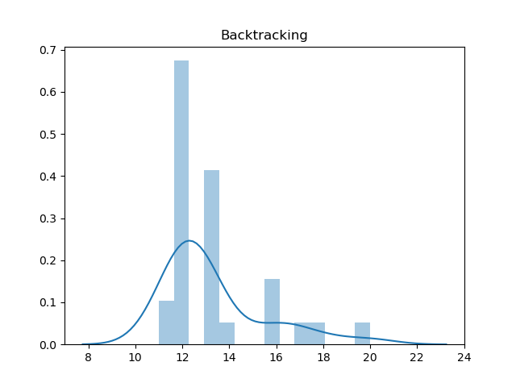
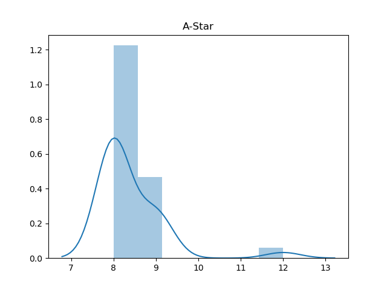
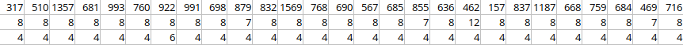
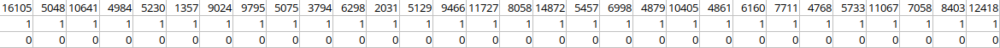

# Assignment 1

The implementation of the Orc Rugby game in SWI-Prolog, v8.0.3 (_latest stable version as of March 7th, 2020_).

The game consists of a map and a runner at (0; 0) that must deliver the ball to the touchdown point (any, if several), avoiding orcs and cooperating with other humans on the field.

The map is a Prolog file that contains the following facts defining the setup:

* `field_size/1` – takes a single positive integer that defines the 1-dimensional length of the map;
* `runner/2` – takes two coordinates that correspond to the initial placement of the runner;
* `human/2` – takes two coordinates that correspond to a position of a human on the map;
* `orc/2` – takes two coordinates that correspond to a position of an orc on the map;
* `touchdown/2` – takes two coordinates that correspond to a position of a touchdown on the map;

In all the above cases a coordinate is an integer from 0 to `field_size - 1`.


Assumptions made throughout the algorithms:

* Orcs and touchdowns cannot coexist in the same cell;
* Field size is greater or equal than zero;
* There is one and only one runner on the map;
* The algorithm doesn't have to terminate on an impossible map.


## Source map

* `orc-rugby-random.pl` – random search;

* `orc-rugby-backtrack.pl` – backtracking search;

* `orc-rugby-astar-sv.pl` – A-Star (1-block vision);

* `orc-rugby-astar-dv.pl` – A-Star (2-block vision);

* `map.pl` – the input to the algorithms;

* `field_utils.pl` – helper library defining common functionality.


## Execution guidelines

All algorithm implementations define a goal `solve/0` which can be directly executed with the command:

```bash
swipl -s orc-rugby-<algorithm>.pl -t solve -q
```


## Implementation details

Common to all algorithms is the idea that a path is a list of three-element tuples, each one containing:

* the current location of the ball (last coordinates)
* the last action taken (either a move or a pass to a certain direction)
* the _origin_ point of the runner (can be thought of 'where there is currently no human')

The origin point is being tracked to avoid passing or handing off to yourself, which would be physically impossible, but logically possible due to the fact that the map remains constant throughout the entire runtime of the algorithm.


### Random Search

The random search algorithm runs 100 attempts to find a solution by taking random actions every time. If the action is a move outside the map, the algorithm picks a different action. If the action causes the humans to lose the round, then an attempt fails. Otherwise, the shortest path among the 100 attempts is taken to a final solution.

There's no upper bound to the length of the solution, so potentially this algorithm could run forever, but the probability of it is very low (provided that there is an orc, so that failing is at all possible).


### Backtracking Search

The backtracking search using the technique of _iterative deepening_, which guarantees that the first solution found is the best solution.

```erlang
field_size(FieldSize),  % get the field size
length(Path, Length),  % increase the path length iteratively
(Length #> FieldSize * FieldSize -> !, fail; true),  % set an upper bound for length
phrase(actions(X, Y, has_pass, X, Y), Path),  % try to find a path of given length
```

The iterative deepening technique picks path lengths increasingly starting from 0 and tries to find the path of that length. Therefore, the first path found will be the shortest, which is a substantial improvement over regular backtracking.

To ensure this algorithm terminates on impossible maps, one may set an upper bound on the path length. In this case, the square of the field size was chosen, since it never makes sense to visit the same cell twice.

Uses the DCG (definite clause grammar) functionality of Prolog to build the path in a clean and elegant way:

```erlang
actions(X, Y, no_pass, _, _) -->
  {
    \+ orc(X, Y),
    \+ touchdown(X, Y),
    human(X, Y),
    moves(Moves),
    member(NewAction, Moves),
    action_type(NewAction, ActionType),
    old_action_new(X, Y, NewAction, XN, YN),
    within_bounds(XN, YN)
  },
  ensure_no_handoff(ActionType, XN, YN),
  actions(XN, YN, no_pass, X, Y).
```


### A-Star

Since the game does not give upfront the information about where the touchdown points reside, one cannot harness the full potential of A-Star, however, a dynamic heuristic function is still possible.

The heuristic evaluates the costs of all possible actions from the current cell and picks the best one. For 2-block vision the best move from the next cell is also taken into the final cost to ensure the benefit from knowing more about the map.  


## Part 1. Statistical comparison for 1-block vision

Let us first consider the sample map from the assignment statement:

```erlang
field_size(20).
human(0, 2).
orc(1, 2).
touchdown(1, 3).

%  4 _ _ _ _ _
%  3 _ T _ _ _
%  2 H O _ _ _
%  1 _ _ _ _ _
%  0 R _ _ _ _
%  x 0 1 2 3 4
```

Below are the runtimes of each algorithm over 30 independent runs on the map described above (in ms):

|           | 1    | 2    | 3    | 4    | 5    | 6    | 7    | 8    | 9    | 10   |
| --------- | ---- | ---- | ---- | ---- | ---- | ---- | ---- | ---- | ---- | ---- |
| Random    | 395  | 478  | 870  | 331  | 240  | 417  | 408  | 780  | 375  | 716  |
| Backtrack | 13   | 12   | 12   | 13   | 12   | 12   | 14   | 12   | 12   | 13   |
| A-Star    | 9    | 8    | 8    | 9    | 8    | 8    | 9    | 8    | 12   | 8    |

|           | 11   | 12   | 13   | 14   | 15   | 16   | 17   | 18   | 19   | 20   |
| --------- | ---- | ---- | ---- | ---- | ---- | ---- | ---- | ---- | ---- | ---- |
| Random    | 788  | 478  | 443  | 413  | 244  | 548  | 344  | 807  | 681  | 288  |
| Backtrack | 12   | 13   | 13   | 12   | 20   | 16   | 13   | 16   | 12   | 12   |
| A-Star    | 8    | 8    | 8    | 8    | 8    | 8    | 8    | 9    | 9    | 8    |

|           | 21   | 22   | 23   | 24   | 25   | 26   | 27   | 28   | 29   | 30   |
| --------- | ---- | ---- | ---- | ---- | ---- | ---- | ---- | ---- | ---- | ---- |
| Random    | 645  | 409  | 445  | 195  | 365  | 602  | 554  | 509  | 380  | 384  |
| Backtrack | 17   | 12   | 11   | 13   | 13   | 18   | 12   | 16   | 11   | 12   |
| A-Star    | 8    | 8    | 8    | 8    | 8    | 8    | 9    | 9    | 8    | 9    |

The distribution of runtime values is close to normal. The occasional increases in runtime are likely due to the operating system performing other processes, so one can treat the distribution as normal and run the Student T-Test to compare the algorithms.

<div style="display: flex; flex-basis: 33%;">
	
	
	
</div>
Our null hypothesis will be that there is no statistically significant difference between the algorithms (we will compare them pairwise).

To perform the T-Test, one may use a spreadsheet. The p-values for the pairs of algorithms are as follows:

* Random Search x Backtracking: $p = 5.71213E-20$
* Random Search x A-Star: $p = 3.61707E-20$
* Backtracking x A-Star: $p = 4.77658E-16$

Considering how low the p-values are, it is evident that there is statistically significant difference between all three algorithms.

------

Let's repeat the calculations for a different map:

```erlang
field_size(20).
human(3, 3).
orc(1, 2).
orc(1, 0).
orc(0, 1).
touchdown(1, 3).

%  4 _ _ _ _ _
%  3 _ T _ H _
%  2 _ O _ _ _
%  1 O _ _ _ _
%  0 R O _ _ _
%  x 0 1 2 3 4
```

In this map the only first move is to make a pass.

For reference, the sampled runtimes are:



where the rows represent runtimes of random search, backtracking and A-Star, respectively.

The p-values for the pairs of algorithms are as follows:

* Random Search x Backtracking: $p = 7.341929E-20$
* Random Search x A-Star: $p = 5.791302E-20$
* Backtracking x A-Star: $p = 4.74719E-26$

------

Finally, let's consider a map without orcs or humans:

```erlang
field_size(20).
touchdown(1, 3).

%  4 _ _ _ _ _
%  3 _ T _ _ _
%  2 _ _ _ _ _
%  1 _ _ _ _ _
%  0 R _ _ _ _
%  x 0 1 2 3 4
```


This map heavily affects the random search because the attempts take a long time to die out.

For reference, the sampled runtimes are:



where the rows represent runtimes of random search, backtracking and A-Star, respectively.

The p-values for the pairs of algorithms are as follows:

* Random Search x Backtracking: $p = 1.82892E-17$
* Random Search x A-Star: $p = 1.81851E-17$
* Backtracking x A-Star: $p = 0$


## Part 2. Statistical comparison for 2-block vision

The 2-block vision ability only affects the A-Star algorithm, as the random search and backtracking do not use vision at all. Therefore, there's no map that was unsolvable for 1-block vision but is solvable now with 2-block vision.

The unsolvability of previously solvable maps for A-Star depends on the order of actions in the hardcoded actions array. In some cases the 2-block vision causes the player to get stuck in an infinite loop of penalized moves. Rearranging the moves to favor up and right directions fixes the problem, however.

Running the T-Test on the first map, we obtain the following p-values:

* Random Search x A-Star (2-block): $p = 1.85065E-17$
* Backtracking x A-Star (2-block): $p = 3.427631E-36$
* A-Star (1-block) x A-Star (2-block): $p = 1.6539E-37$

The 2-block vision capability did, however, bring the mean runtime of A-Star on this map from 8.4 down to 3.067, which is a substantial improvement.


## Part 3. Corner-case maps

Evidently, an impossible to solve map would be the one that doesn't contain a touchdown. The present implementation of A-Star isn't able to detect such cases and thus hangs indefinitely. The backtracking search has an upper bound on the length of the path and thus is able to fail in 14.8 seconds for a 3x3 map. The random search fails only if there's an orc in the map to die from, in which case it terminates in 87 milliseconds. Otherwise, however, the search hangs.

> A simple improvement of the code can counter the hang issue: posing a subgoal `touchdown(X, Y)`. If this unites with any X, Y, then the search algorithms may be continued normally, otherwise they are not even run.


A simpler case of an impossible to solve map would be when a runner is completely surrounded by orcs without a chance of passing. An example of such a map would be the following:

```erlang
orc(0, 1).
orc(1, 1).
orc(1, 0).
touchdown(2, 2).
```

In this case the random search fails in 30 milliseconds, the backtracking and A-Star (1-block) fail in 1 millisecond and A-Star (2-block) fails in 3 milliseconds. All algorithms are able to terminate successfully.

The common thing about impossible maps is that they defeat the purpose of the game in one way or another. For sensible arrangements the maps are possible to solve.


## Bonus. Maps and explanations

Let's consider the first, sample map and analyze the output of all 4 algorithms.

```erlang
field_size(20).
human(0, 2).
orc(1, 2).
touchdown(1, 3).

%  4 _ _ _ _ _
%  3 _ T _ _ _
%  2 H O _ _ _
%  1 _ _ _ _ _
%  0 R _ _ _ _
%  x 0 1 2 3 4
```

<div style="display: flex; justify-content: space-between; padding: 0 2em;">
  <div>
    <b>Random</b>
    <pre>
P 0 2
  0 3
  1 3
    </pre>
  </div>
  <div>
    <b>Backtracking</b>
    <pre>
  0 1
  0 3
  1 3
    </pre>
  </div>
  <div>
    <b>A-Star (1-block)</b>
    <pre>
  0 1
  0 3
  1 3
    </pre>
  </div>
  <div>
    <b>A-Star (2-block)</b>
    <pre>
P 0 2
  0 3
  1 3
    </pre>
  </div>
</div>

It is noteworthy that all algorithms were able to produce the best solution length – 3.

We see that backtracking and A-Star (1-block) preferred a move up to the pass. For backtracking it is merely because the move up is earlier in the array of all available actions that the pass. For A-Star, however, it demonstrates that this algorithm will never pass because there's not enough knowledge of the map for the pass to matter and this algorithm doesn't backtrack.

The 2-block version of A-Star, however, did notice that it is worth passing to a human to cut one block, although it still produces a solution of the same length.

------

If we take the same map, but move the human and the touchdown one block up.

```erlang
field_size(20).
human(0, 2).
orc(1, 2).
touchdown(1, 3).

%  4 _ T _ _ _
%  3 H _ _ _ _
%  2 _ O _ _ _
%  1 _ _ _ _ _
%  0 R _ _ _ _
%  x 0 1 2 3 4
```

<div style="display: flex; justify-content: space-between; padding: 0 2em;">
  <div>
    <b>Random</b>
    <pre>
P 0 3
  1 3
  1 4
    </pre>
  </div>
  <div>
    <b>Backtracking</b>
    <pre>
P 0 3
  0 4
  1 4
    </pre>
  </div>
  <div>
    <b>A-Star (1-block)</b>
    <pre>
  0 1
  0 2
  0 4
  1 4
    </pre>
  </div>
  <div>
    <b>A-Star (2-block)</b>
    <pre>
  0 1
P 0 3
  0 4
  1 4
    </pre>
  </div>
</div>

Here's where the deficiency of A-Star is visible due to the lack of knowledge. The random search and backtracking outperform A-Star by producing the path one shorter. The A-Star prefers to be 100% sure that there is a receiver in front and only then pass.


## Authorship

This report, as well as the source code were written by Lev Chelyadinov, B18-06.
All external sources were cited.
